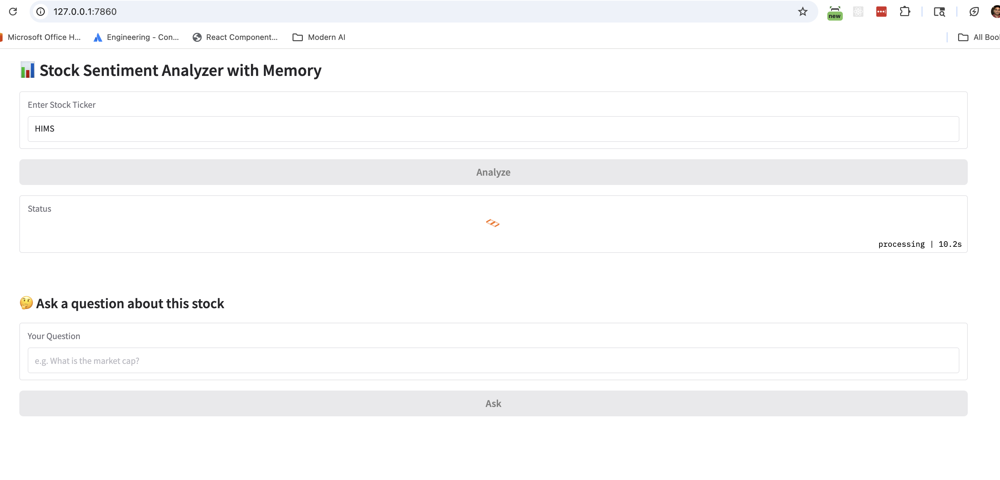
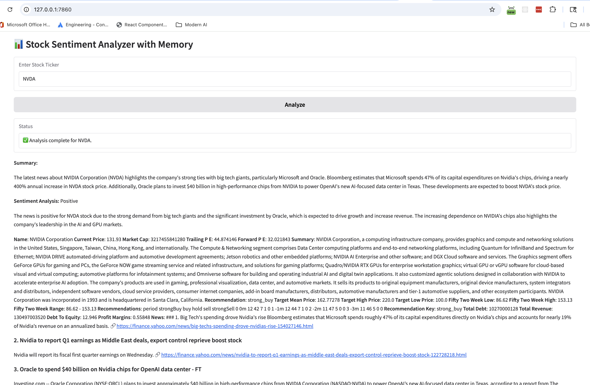
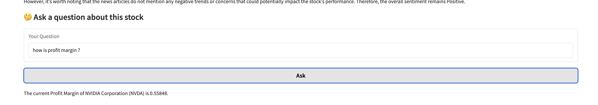

# Stock Analyzer

## Overview
This project is a stock analysis tool that allows users to analyze stock data using various indicators and strategies. It provides a user-friendly interface for selecting stocks, applying indicators, and visualizing the results.

## Features
- Fetch stock data from Yahoo Finance
- Fetch company news from DuckDuckGo
- Pass the stock data and news to LLM (Language Model) for analysis
- Get Sentiment Analysis

# Technologies Used
- Python
- Ollama running on localhost with the model `llama3.2:latest`
- DuckDuckGo for news scraping
- Yahoo Finance for stock data
- Gradio for the user interface

## UI Screenshot

## Future Improvements
- Preprocess the news and pass it as summary to the LLM
- Add more indicators and strategies
- Add global events and news that impact the stock market and individual stocks