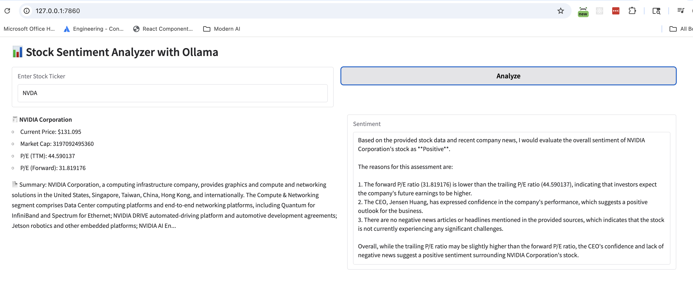

# Stock Analyzer

## Overview
This project is a stock analysis tool that allows users to analyze stock data using various indicators and strategies. It provides a user-friendly interface for selecting stocks, applying indicators, and visualizing the results.

## Features
- Fetch stock data from Yahoo Finance
- Fetch company news from DuckDuckGo
- Pass the stock data and news to LLM (Language Model) for analysis
- Get Sentiment Analysis

## UI Screenshot
